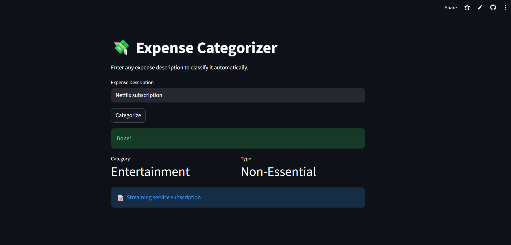

# Expense Categorizer using LangChain + Groq/Gemini

An AI-powered Expense Categorization system built using **Python**, **LangChain**, and **LLMs (Gemini/Groq)** that automatically classifies user expenses into categories such as Food, Travel, Utilities, Entertainment, Shopping, etc.

This project demonstrates:
- Prompt Engineering
- LLM Integration
- Structured Output Parsing
- Environment Variable Management
- Git & GitHub Workflow
- Streamlit-based AI Applications

---

# Project Overview

Managing and categorizing expenses manually is time-consuming.  
This project uses a Large Language Model (LLM) to intelligently analyze expense descriptions and classify them into meaningful categories.

## Example

| Input Expense | Predicted Category |
|---|---|
| Paid electricity bill | Utilities |
| Uber ride to office | Travel |
| Bought groceries | Food |
| Netflix subscription | Entertainment |

The model also predicts:
- Expense Type
- Confidence Notes

---

# Features

- AI-powered expense categorization
- LangChain integration
- Structured output parsing
- Environment variable security using `.env`
- Groq/Gemini model support
- Clean modular code architecture
- Streamlit-ready application
- GitHub-ready project structure

---

# Tech Stack

| Technology | Purpose |
|---|---|
| Python | Backend Programming |
| LangChain | LLM Framework |
| Groq / Gemini API | AI Model Provider |
| Pydantic | Structured Output Parsing |
| dotenv | API Key Management |
| Streamlit | Frontend UI |
| Git & GitHub | Version Control |

---

# Project Structure

```bash
expense_categorizer/
│
├── app.py
├── main.py
├── model.py
├── parser.py
├── prompt.py
├── requirements.py
├── .gitignore
├── README.md
└── .env
```

## Application Preview

<p align="center">
  
</p>

---

# Step-by-Step Setup Guide

## 1. Clone Repository

```bash
git clone https://github.com/Anjiembadi/expense-categorizer.git
```

Move into project folder:

```bash
cd expense-categorizer
```

---

## 2. Create Virtual Environment

### Windows

```bash
python -m venv myenv
```

Activate virtual environment:

```bash
myenv\Scripts\activate
```

---

## 3. Install Dependencies

```bash
pip install -r requirements.txt
```

If `requirements.txt` is unavailable:

```bash
pip install langchain langchain-groq langchain-google-genai python-dotenv pydantic streamlit
```

---

## 4. Create `.env` File

Inside project folder create:

```bash
.env
```

Add your API key:

### For Groq

```env
GROQ_API_KEY=your_api_key
```

### For Gemini

```env
GOOGLE_API_KEY=your_api_key
```

---

## 5. Run Application

### Run Python Script

```bash
python main.py
```

### Run Streamlit App

```bash
streamlit run app.py
```

---

# How the Project Works

## Step 1: User Enters Expense

Example:

```text
Paid electricity bill
```

---

## Step 2: Prompt Engineering

The expense description is inserted into a carefully designed prompt template.

Example:

```python
prompt_template.format(expense_description=description)
```

---

## Step 3: LLM Processing

LangChain sends the prompt to:
- Groq
- Gemini

The AI model analyzes the expense meaning.

---

## Step 4: Structured Output Parsing

The response is converted into structured fields:

```python
expense_category
expense_type
confidence_note
```

Using:
- Pydantic
- Output Parser

---

# Example Output

```text
Input: Paid electricity bill

Category: Utilities
Type: Necessary
Confidence: High
```

---

# Core Files Explanation

## `main.py`

Main execution logic:
- accepts expense
- invokes model
- parses output
- prints results

---

## `model.py`

Responsible for:
- loading API keys
- initializing LLM
- connecting LangChain with model

---

## `prompt.py`

Contains:
- prompt templates
- instructions for AI model

---

## `parser.py`

Responsible for:
- converting raw LLM output
- validating structured response

---

# Example Workflow

```text
User Input
   ↓
Prompt Template
   ↓
LangChain
   ↓
LLM (Groq/Gemini)
   ↓
Structured Parser
   ↓
Final Categorized Output
```

---

# Sample Test Cases

```python
test_cases = [
    "Paid monthly electricity bill",
    "Bought groceries",
    "Uber ride",
    "Netflix subscription",
    "Bought a Louis Vuitton bag"
]
```

---

# API Providers

## Groq (Recommended)

Advantages:
- Extremely Fast
- Free Tier
- Stable API
- OpenAI-compatible

Website:
https://console.groq.com

---

## Gemini

Advantages:
- Google's LLM
- Good reasoning capabilities

Website:
https://aistudio.google.com

---

# GitHub Workflow Used

```bash
git init
git add .
git commit -m "Initial commit"
git branch -M main
git remote add origin <repo_url>
git push -u origin main
```

---

# Important Best Practices

## Never Upload

- `.env`
- API Keys
- `myenv/`

These are excluded using:

```gitignore
myenv/
.env
__pycache__/
```

---

# Future Improvements

- Expense analytics dashboard
- Database integration
- Multi-user authentication
- Budget prediction
- Receipt OCR scanning
- Voice-based expense entry
- Fine-tuned custom model
- Deployment on Streamlit Cloud

---

# Learning Outcomes

This project helps understand:
- LangChain basics
- Prompt Engineering
- LLM Integration
- API Handling
- Structured Parsing
- Git & GitHub
- AI Application Development

---

# Author

## EMBADI ANJI

- GitHub: https://github.com/Anjiembadi
- LinkedIn: https://linkedin.com/in/embadi-anji-31122531a

---

# License

This project is created for educational and portfolio purposes.
